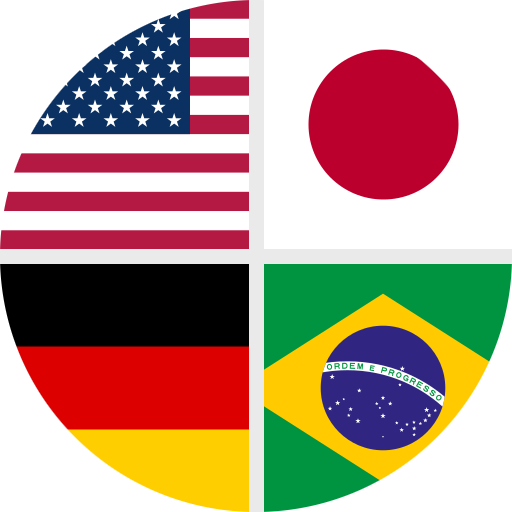

<div align="center">
    
</div>

<div align="center">

# 🏳️ Flags 🌍

[](https://www.android.com/)
[](https://developer.android.com/tools/releases/platforms#7.0)
[](https://github.com/aftly/Flags/releases)
[](https://github.com/aftly/Flags/releases)
[](https://github.com/aftly/Flags/blob/main/LICENSE)

</div>

## ❔ About
- **Flags** is a free and open source Android app for displaying various flags of the world with categorisation for descriptions and user sorting. Also includes a game.

- *This app is currently in alpha and is feature incomplete. Feedback is welcome, please submit feature requests and issues via [GitHub Issues](https://github.com/aftly/Flags/issues).*
<br>

## 📸 Screenshots
- **TODO**
<br>

## 📱 Installation
[](https://github.com/aftly/Flags/releases)

**Verification info**:
- APK Signing Certificate hash (SHA-256):
  - *(Eg. for use with [AppVerifier](https://github.com/soupslurpr/AppVerifier))*
```
dev.aftly.flags 2E:F2:C1:C7:6B:7F:BB:06:F7:AD:55:07:C6:6B:7D:12:4B:F3:2F:95:CB:01:CD:62:C8:DD:E2:F5:5F:3B:71:6C
```
<br>

## ⭐ Features
- List flags and search with text
- View flags and description of it's entity from it's categories
- View & Search shows (politically) related flags
- Flag knowledge game
- View score history and details
- Filter flags (in list and game) via a categories menu
- Settings for basic theme preferences
<br>

 **📌 TODO:**
- [x] Create **App icon**
- [x] Add **Scroll to top button** on list and search screens
- [x] **Fullscreen flag image screen**
- [x] Fullscreen view orientation relative to image aspect ratio & button for unlocking screen orientation
- [x] Searches return politically related flags
- [x] Search result exact match sorts item to first position in list, followed by related flags
- [x] Filter searches
- [x] **Category multi-selection** in filter menu
- [x] Show and select politically related flags on flag view screen (with button in top bar)
- [x] **Full screen carousel** for flags in current list & flag name as header
- [x] UI Counter to show number of flags in current list on View/List screen
- [x] Move search feature into list/view flags screen
- [x] Add **Open in Wikipedia button** to Flag screen
- [x] **Game**: Button to show correct answer
- [x] **Game over dialog** with basic score info and buttons for exit, replay, score details, history and share
- [x] **Game timer** with Standard and Time Trial modes
- [x] **Settings screen** for Theme customisation and about info
- [x] **Settings data persistence** (stored in app data)
- [x] **Game score details** card shows basic score overview & lists of guessed, skipped, shown and remainder flags
- [x] **Game score history screen & data persistence** *(stored in app data)*
- [x] Deselect keyboard and text fields when tap off
- [x] Replace **Start menu** with **Navigation drawer**
- [x] Implement basic **Splash screen** theming *(reflects system theme & basic app colors)*
- [x] **Save flags** to user list
- [x] Add more flags *(to less populated categories and more popular related flags)*
- [x] Expand related flags menus into Political and Chronological menus with sorting by group
- [x] Sort exact match related flags by group
- [x] Ease of use: Links in category descriptions, long click search items populates query
- [x] **(Partially Complete)** - Optimize app for different system Font sizes
<br>

- [ ] Date mode for Game
- [ ] Add screenshots of app to **README**
- [ ] **Submit app to F-Droid**
- [ ] Add Python scripts to external repository
- [ ] Add regime type categories (for political flags) from **OurWorldInData**
- [ ] **More settings features**: *Eg.* Strictness of user guesses for game, disable animations for older devices
- [ ] Download flag image to local files feature
- [ ] Pop up warning messages when invalid/not allowed user action
- [ ] Shareable score history
- [ ] Add flag ISO codes?
- [ ] Optimize app for different screen resolutions and aspect ratios
- [ ] Implement production tests
- [ ] Language translations
<br>


## 🛠 Design
- Built with Jetpack Compose in Kotlin, following architecture principles described on Android Developers such as UDF, SSOT, separation of concerns, and ViewModels for managing business state and logic.

- Flag info uses local data, originally sourced from Wikipedia via Python scripts for getting flag images, common names, official names and alternate names.
Flag category info is derived more manually, by filtering from broader categories such as on [countries by system of government](https://en.wikipedia.org/wiki/List_of_countries_by_system_of_government) and other Wikipedia lists.
<br>

## ❤️ Acknowledgements 
 - Flag information sourced from [Wikipedia](https://en.wikipedia.org/wiki/Main_Page)
<br>

## 🔖 [License](https://github.com/aftly/Flags/blob/main/LICENSE)
```
Licensed under the Mozilla Public License, Version 2.0.
```
